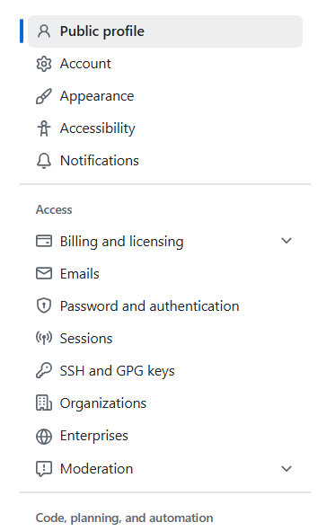
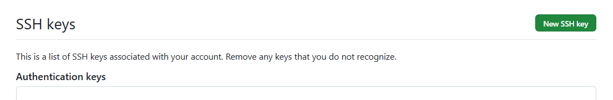

# Why you need SSH for Github Operations
Once SSH keys are set up, you never have to enter credentials again. SSH keys use public-key cryptography, which is more secure than password-based authentication. Push/pull operations work without interruption. SSH has less overhead than HTTPS for repeated operations

HTTPS often requires storing tokens/passwords, which can be a security risk. GitHub deprecated password authentication in 2021, so you need personal access tokens that expire. You'll get prompted for credentials on each push unless you configure credential helpers. 

### Check if you have an SSH key
```bash
ls -la ~/.ssh
```
Look for files like `id_rsa` and `id_rsa.pub` (or `id_ed25519` and `id_ed25519.pub`).


### If you don't have an SSH key, create one
```bash
ssh-keygen -t ed25519 -C "your_email@example.com"
```
Press Enter to accept the default location, and optionally set a passphrase.

### Add your public key to GitHub
#### 1. Copy your public key
```bash
cat ~/.ssh/id_ed25519.pub
```

#### 2. Go to GitHub → Settings → SSH and GPG keys → New SSH key


#### 3. Paste the key and save


### Test the connection
```bash
ssh -T git@github.com
```